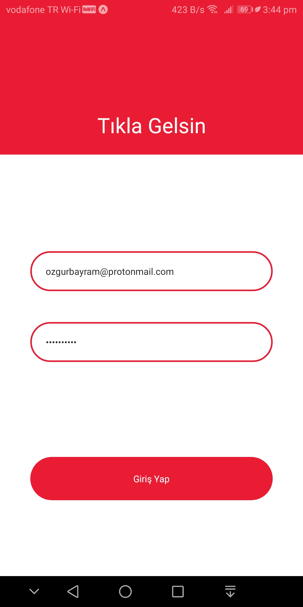
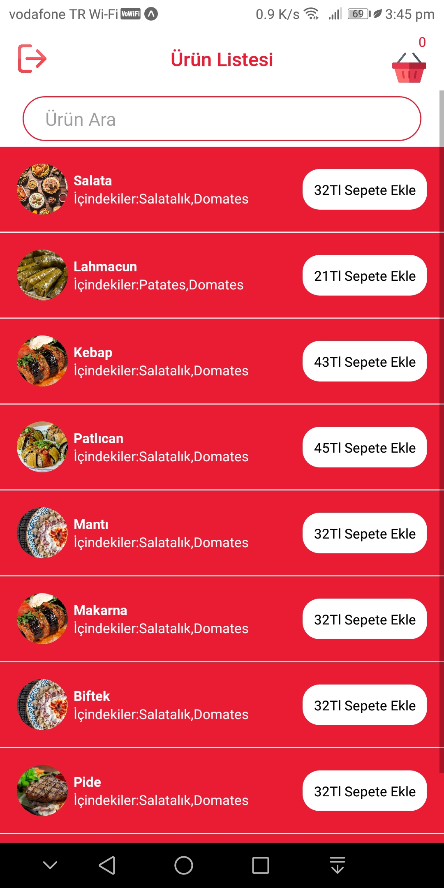
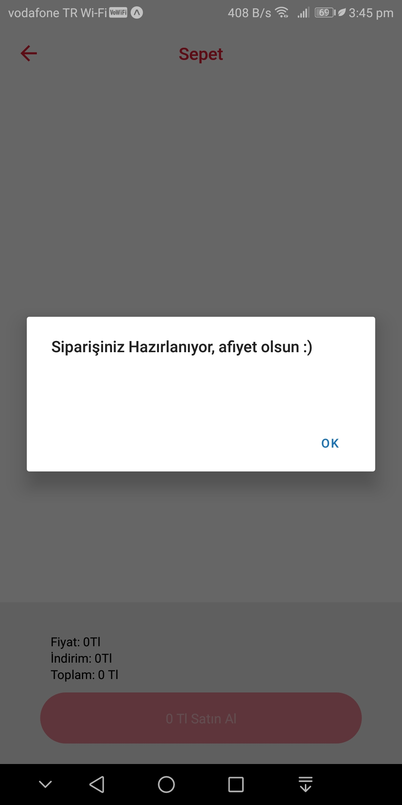

# Tıkla Gelsin Case 
Simple food delivery app like Tıkla Gelsin

## Technologies
* React Native
* TypeScript
* Expo
* Reanimated
* React Navigation
* Expo Linking

## Demo






## Setup

Clone the repository
```
git clone https://github.com/ozgurbayram/TiklaGelsinCase.git
cd TiklaGelsinCase
```

Install packages
```
yarn install
```

### Adding Product via Deep link 
``` console
adb shell am start -a android.intent.action.VIEW -d "exp://192.168.1.107:19000/--/products?menuId=2"
```
